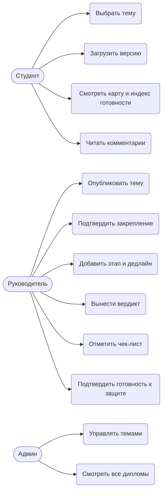
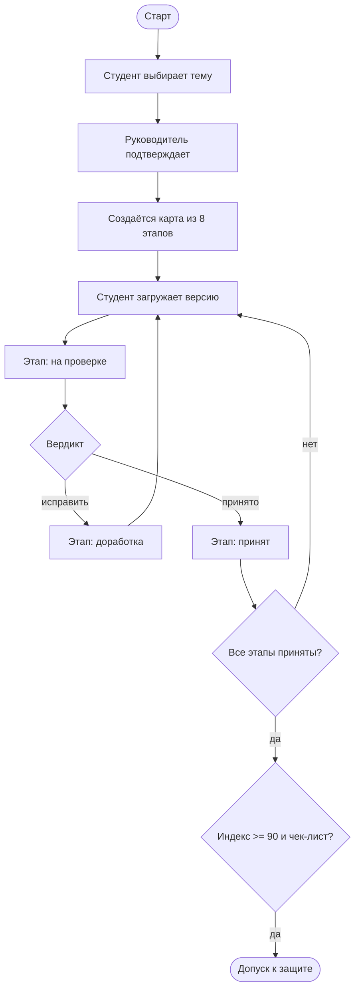
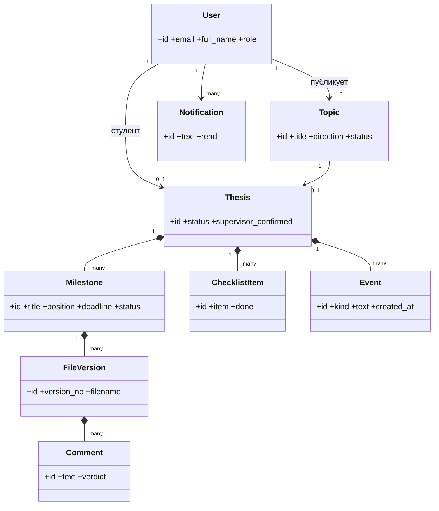
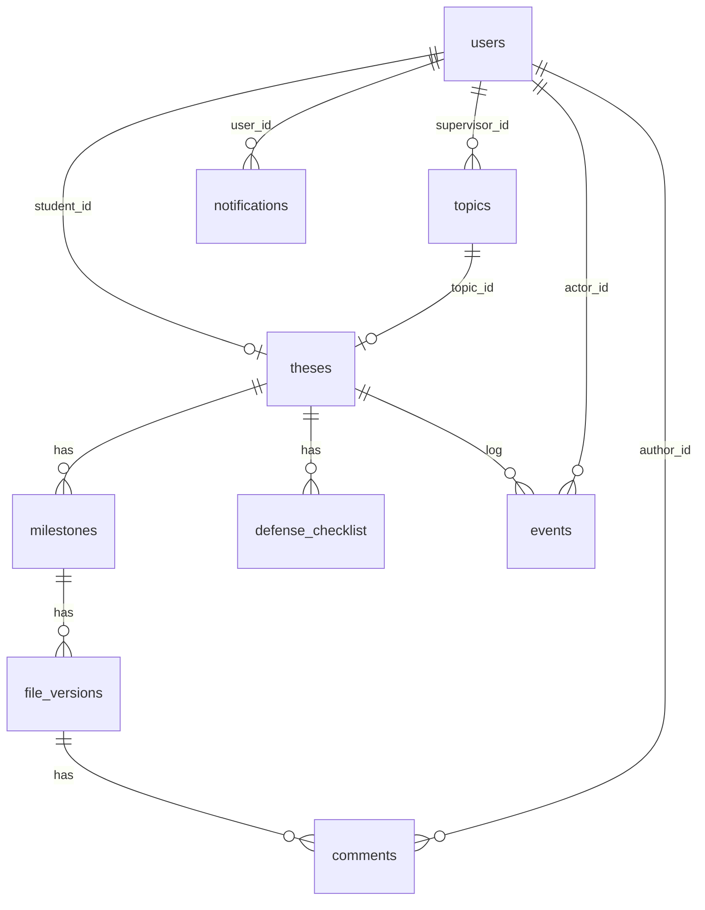
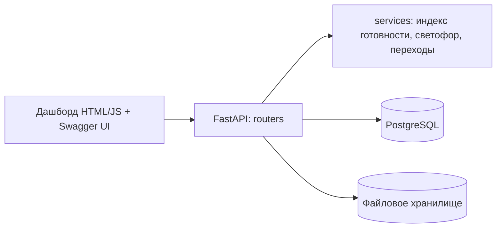
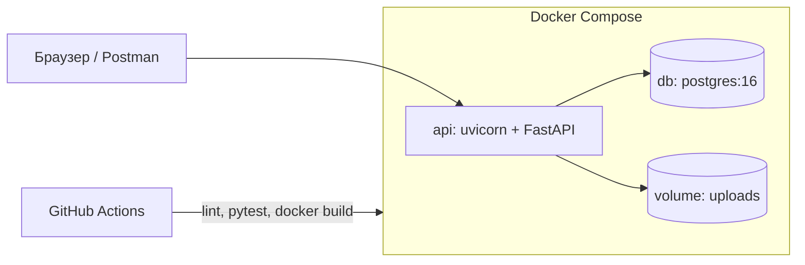

# Диаграммы ThesisPath (Mermaid, рендерятся на GitHub)

## Use Case

```mermaid
flowchart LR
  S([Студент]) --> U1(Выбрать тему)
  S --> U2(Загрузить версию)
  S --> U3(Смотреть карту и индекс готовности)
  S --> U4(Читать комментарии)
  T([Руководитель]) --> V1(Опубликовать тему)
  T --> V2(Подтвердить закрепление)
  T --> V3(Добавить этап и дедлайн)
  T --> V4(Вынести вердикт)
  T --> V5(Отметить чек-лист)
  T --> V6(Подтвердить готовность к защите)
  A([Админ]) --> W1(Управлять темами)
  A --> W2(Смотреть все дипломы)
```

## Activity: цикл работы над этапом

```mermaid
flowchart TD
  A([Старт]) --> B[Студент выбирает тему]
  B --> C[Руководитель подтверждает]
  C --> D[Создаётся карта из 8 этапов]
  D --> E[Студент загружает версию]
  E --> F[Этап: на проверке]
  F --> G{Вердикт}
  G -- исправить --> H[Этап: доработка] --> E
  G -- принято --> I[Этап: принят]
  I --> J{Все этапы приняты?}
  J -- нет --> E
  J -- да --> K{Индекс >= 90 и чек-лист?}
  K -- да --> L([Допуск к защите])
```

## Class

```mermaid
classDiagram
  class User{+id +email +full_name +role}
  class Topic{+id +title +direction +status}
  class Thesis{+id +status +supervisor_confirmed}
  class Milestone{+id +title +position +deadline +status}
  class FileVersion{+id +version_no +filename}
  class Comment{+id +text +verdict}
  class ChecklistItem{+id +item +done}
  class Event{+id +kind +text +created_at}
  class Notification{+id +text +read}
  User "1" --> "0..*" Topic : публикует
  User "1" --> "0..1" Thesis : студент
  Topic "1" --> "0..1" Thesis
  Thesis "1" *-- "many" Milestone
  Thesis "1" *-- "many" ChecklistItem
  Thesis "1" *-- "many" Event
  User "1" --> "many" Notification
  Milestone "1" *-- "many" FileVersion
  FileVersion "1" *-- "many" Comment
```

## ER

```mermaid
erDiagram
  users ||--o{ topics : supervisor_id
  users ||--o| theses : student_id
  topics ||--o| theses : topic_id
  theses ||--o{ milestones : has
  theses ||--o{ defense_checklist : has
  milestones ||--o{ file_versions : has
  file_versions ||--o{ comments : has
  users ||--o{ comments : author_id
  theses ||--o{ events : log
  users ||--o{ notifications : user_id
  users ||--o{ events : actor_id
```

## Component

```mermaid
flowchart LR
  Browser[Дашборд HTML/JS + Swagger UI] --> API[FastAPI: routers]
  API --> SVC[services: индекс готовности, светофор, переходы]
  API --> DB[(PostgreSQL)]
  API --> FS[(Файловое хранилище)]
```

## Deployment

```mermaid
flowchart LR
  U[Браузер / Postman]
  subgraph DC[Docker Compose]
    API[api: uvicorn + FastAPI] --> DB[(db: postgres:16)]
    API --> V[(volume: uploads)]
  end
  U --> API
  GH[GitHub Actions] -->|lint, pytest, docker build| DC
```
